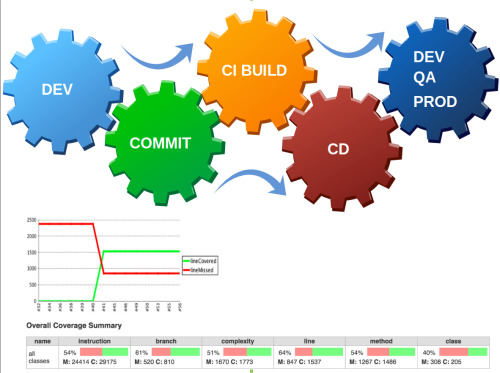

Another key design principle for microservices architecture is __automation__. Microservice architecture enables the teams to have frequent releases and shorter time to production. But you certainly cannot ship your code into production without testing it. Whenever the code is released to production it must be tested. So we need automated tools that can test our code every time we deploy it to production.

There are two categories of automation tools available.

__Continuous integration(CI)__ tools integrates well with the source control systems. The tools compile the code, run unit test cases and run integration test cases whenever they detect a change in code base. The tools provide an immediate feedback on the change made to the code. The tools provide confidence to the team that recent code changes integrate well with the entire system. The tools are particularly helpful when many developers are working on the same code base, as the tools will alert the team if any breaking change is made. However, it is the onus of the team to write exhaustive test cases for the functionalities. These CI tools can also help to generate the code quality reports. The tools not only fires the test cases but also labels/version the code for next step, if all test cases are successful.

Another set of tools are __Continuous Deployment(CD)__ tools. The team can configure CD tools to deploy the microservice to various environments such as Dev, QA or Production. These tools work along with CI tools to deploy the code. Once all the test cases are successful, CD tools pick up the CI build and deploy it to the targeted environment.

CI/CD tools help the teams to identify errors early by running automated tests and deployment pipelines. You can consider the tools such as Jenkins, Travis, MS Team foundation server etc to perform these jobs for your team.